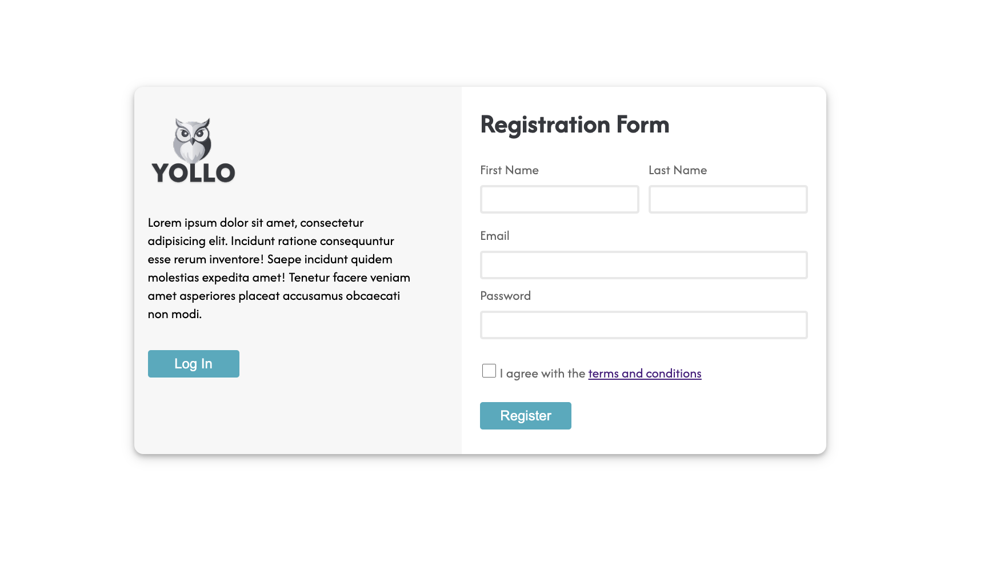

# Registration Form

Every time you access a website, in most cases, you’ll need to register as a user and create an account so that your information is attached to your profile and doesn’t get lost. You’ve seen tons of registration forms since they’re the entry point to multiple websites. Now, it’s time to create one yourself! 🎉

In this project, we will build a registration form using HTML and CSS. This hands-on project is designed to help you practice HTML5 and CSS3 while building something practical and visually appealing.

🗒️ **How to Start This Project?**
---
1. **Ensure You Have a GitHub Account**
   If you don’t have one, sign up at [https://github.com](https://github.com/).
2. Navigate to the project template
   - Create a repository from the template to your account
   - Open the project with a new codespace
   - Once you did it once you can open the codespace that was previously created.

---

## **📝 Requirements:**

- Create the HTML and CSS3 needed to replicate this similar registration form.
   - 

---
#### **Form Fields:**

- **First Name** (Text Input)
- **Last Name** (Text Input)
- **Email Address** (Email Input)
- **Password** (Password Input)
- **Terms and Conditions** (Checkbox)
- **Submit Button**
---
#### **Styling:**

- Use **CSS3** to style the form and make it visually appealing.
- Use **Google Fonts** to enhance typography.
---
#### **Layout:**

- Organize form elements using containers and proper alignment.
- Use Flexbox for layout.
---
#### **Adding Google Fonts**

1.	Visit [Google Fonts](https://fonts.google.com/).

2.	Select a font you like.

3.	Click on **‘Select this style’**.

4.	Click on the **‘Embed’** tab and copy the <link> tag.

5.	Paste the <link> tag into the <head> section of your HTML file.
---
#### **🌐 Including the Logo**

- The project contains a folder called assets with a svg logo in it. Make sure you include it in the project. 
---
### **🤔 What to Do If You Are Stuck?**

#### **Review Fundamentals:**

- Revisit your notes or resources on HTML5 and CSS3 basics.

#### **Ask for Help:**

- Don’t hesitate to reach out to your instructor or peers for assistance.
---
### **📚 Fundamentals Covered**

#### This exercise covers the following fundamentals:

1.	**Basic Structure of an HTML5 Document**

2.	**Linking CSS Stylesheets**

3.	**Using Google Fonts**

4.	**CSS Selectors and Specificity**

5.	**Box Model: Margins, Padding, and Borders**

6.	**HTML5 Form Elements and Attributes**

7.	**Form Validation Techniques**

8.	**Styling Forms with CSS**

9.	**Responsive Design Principles**

10.	**Accessibility Best Practices**
---
## **✅ Submission Checklist**

- [ ]  All required form fields are present.
- [ ]  HTML file is well-structured and uses semantic tags.
- [ ]  CSS file properly styles the form.
- [ ]  Form validation works as expected.
- [ ]  The form is responsive and looks good on various devices.
- [ ]  Code is clean and well-commented.
- [ ]  Tested in multiple browsers for compatibility.